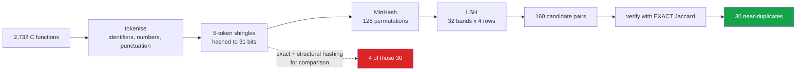

<h1 align="center">04 · Near-duplicate detection</h1>
<p align="center"><i>Exact hashing found 4 of 30 near-duplicates. It missed 87%.</i></p>

<p align="center">
  <a href="#the-result">Result</a> &middot;
  <a href="#what-this-changes-for-devign-leakage">What it changes</a> &middot;
  <a href="#method">Method</a> &middot;
  <a href="#validating-the-estimator">Validating the estimator</a> &middot;
  <a href="#limitations">Limitations</a>
</p>

<p align="center">
  
  
  
  
</p>

---

> ### Hashing a normal form found 4 of 30 near-duplicates. Sixteen of the ones it missed carry conflicting labels.

[devign-leakage](https://github.com/hammasbuilds/devign-leakage) found duplicates by hashing a
normalised form, and stated plainly that *"two functions differing by one statement are not
detected at either level"*. This measures how many that is — and because Devign is
labelled, how many of them disagree about whether the same code is vulnerable.

---

## The result

Devign test split, 2,732 C functions (1,255 vulnerable / 1,477 not).
Near-duplicate = Jaccard ≥ 0.8 over 5-token shingles.

| Method | Pairs found | Time |
|---|---:|---:|
| exact hash (whitespace-normalised) | 2 | 0.6 s |
| structural hash (identifiers renamed) | 22 | — |
| **MinHash + LSH, verified ≥ 0.8** | **30** | 2.9 s |

| | Count |
|---|---:|
| Near-duplicates **hashing missed** | **26 of 30 (87%)** |
| …of those, **conflicting labels** | **16** |
| All near-duplicates with conflicting labels | 20 |

**Hashing a normal form catches only exact structural twins.** Anything differing by a
single statement — an added bounds check, a renamed call with an extra argument — hashes
differently and is invisible to it.

---

## What this changes for devign-leakage

That repo reported **4 exact duplicate pairs in the test split, all with conflicting
labels**, and called the resulting ceiling "small — four rows out of 2,732".

With near-duplicate detection the count is **20 conflicting pairs, 16 of them invisible to
hashing**. A five-fold increase.

It is still not large in absolute terms. But the earlier conclusion — *"a
dataset-quality observation, not a refutation"* — rested on a number that was **an
artefact of the detection method**, not a property of the dataset. That is worth correcting
in the repo that made it.

---

## Method



**LSH is a filter, not a verifier.** Its banding gives an effective threshold near 0.42, so
it returns candidates well below the 0.8 cutoff. Every candidate is then checked with
**exact Jaccard** — the approximation narrows the search from 3.7 million possible pairs to
160, and exact computation decides.

`test_lsh_is_a_filter_not_a_verifier` asserts that distinction directly.

**Punctuation is kept in the tokenizer.** In C, braces and semicolons carry structure;
dropping them would make two functions with different control flow look alike.

---

## Validating the estimator

MinHash is an approximation, so its error is measured rather than assumed — on **two**
samples, because one of them is misleading alone:

| Sample | MAE vs exact Jaccard |
|---|---:|
| 400 random pairs | **0.0011** |
| 30 verified near-duplicates | **0.0199** |
| theoretical 1/√128 (worst case, at s = 0.5) | 0.0884 |

**The 0.0011 is misleading and is reported only to say so.** Random pairs are almost all
disjoint, and MinHash returns *exactly* 0 for disjoint sets — so that figure is mostly
counting easy zeros, and would suggest the estimator beats theory by 80×.

The number that matters is **0.0199 on pairs that are actually similar**. At s ≈ 0.9 the
true standard error is √(s(1−s)/n) = **0.0265**, so the measured error is exactly what
theory predicts. The estimator is behaving correctly, which is what the check is for.

---

## Limitations

- **The 0.8 cutoff is a choice.** Lower it and the count rises; there is no natural
  boundary between "near-duplicate" and "similar". The cutoff is stated rather than tuned.
- **LSH can miss pairs.** Banding is probabilistic: a pair above 0.8 that collides in no
  band is never a candidate and never verified. The 30 found is therefore a **lower
  bound**, not a count.
- **Shingle size k = 5 is a parameter**, and the result depends on it. Smaller k finds more
  pairs and more false ones.
- **Token-level Jaccard ignores order.** Two functions with the same statements in a
  different sequence score as near-identical. For detecting copy-paste that is usually
  right; for detecting semantic equivalence it is not.
- **Test split only.** The train split was never obtainable — the same 17.85 MB download
  that blocked devign-leakage.

## Run it

```bash
python src/compare.py test     # the tables above
pytest -q                      # 24 tests, no dataset, no network
```

## Tests

24 tests. The MinHash tests check the estimator **against exact Jaccard on constructed
sets**, which is the only way to know an approximation is working rather than merely
running.

One is a regression test: `test_hashes_fit_the_prime_field`. The first version used 64-bit
digests, and `(a*x + b) mod p` overflowed `int64` silently — the classic MinHash
implementation trap. Hashes now live below a 31-bit prime so the product stays exact.

## Layout

```
src/minhash.py   shingling, MinHash signatures, banded LSH
src/compare.py   hashing vs MinHash on Devign, and the label-conflict count
tests/           24 tests, no dataset needed
results/         duplicates_test.json, including 25 example missed pairs
```

## Keywords

MinHash · LSH · locality-sensitive hashing · near-duplicate detection · Jaccard
similarity · shingling · code clone detection · Devign · CodeXGLUE · data leakage ·
dataset quality · label noise · deduplication · approximate similarity search
